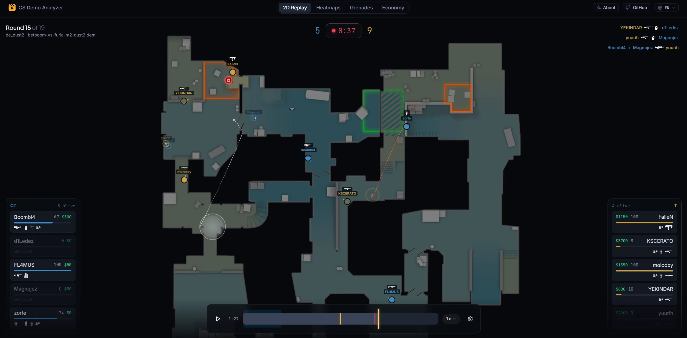

# CS2d.app

The fastest free browser-based 2D replay analyzer for **Counter-Strike 2**
demos. Drop a `.dem` file and rewatch the match round by round: no install,
no upload, not a single byte leaving your machine.



## Why

Existing tools have too much friction: install a database, spin up Docker, wire up
config, all before you can watch a single round, and the visual side still feels
like an afterthought.

I just needed a simple way to analyze the comms of PUG matches with my friends, so
I built the tool I always wished existed: instant to open, good-looking, and fully
client-side. It is open source so it can grow with the CS2 community, a game I have
played since I was a kid, and a first step toward building in esports.

## Features

- **2D replay** with round-by-round playback of player movement, duels and timing,
  a live scoreboard, killfeed and in-game chat, and auto-advance between rounds.
- **Heatmaps** for deaths, presence and utility, filterable by side, player and
  round, with multi-floor support for maps like Nuke and Vertigo.
- **Grenade trajectories** for smokes, molotovs, HEs, flashes and decoys, with the
  option to jump straight into the replay from a throw, plus in-replay visual
  effects for grenades and the bomb explosion.
- **Utility analysis**: flash effectiveness (who blinded whom and for how long)
  and HE / molotov damage dealt, broken down per player.
- **Economy** breakdown per round: buy types, equipment value and money flow.
- **Drawing tools**: a telestrator to draw on the map and break down positions
  and executes.
- **Replay comments**: annotate specific moments and revisit them later.
- **Export / import**: save an analyzed match as a compact `.cs2dv` file and
  reopen it instantly, without re-parsing the original demo.
- **Player comms**: in-game voice replayed alongside the action.
- **Major showcase**: rewatch Counter-Strike Major playoff matches in 2D, map by
  map, with the replays bundled in the project.
- **100% client-side**: the demo is read and parsed in a Web Worker; nothing is
  ever sent to a server.
- **Local history** of recently analyzed demos, kept in your browser (reopening
  one does not re-upload it).
- **Multi-language UI**: 9 languages so far: English, Portuguese, Spanish, French,
  German, Russian, Polish, Turkish and Ukrainian.

Supported uploads: `.dem`, `.gz`, `.zip` and `.zst` (CS2 / Source 2).

## Tech stack

- [Vue 3](https://vuejs.org), [Vue Router](https://router.vuejs.org) and
  [Vite](https://vite.dev)
- [Tailwind CSS](https://tailwindcss.com), [Reka UI](https://reka-ui.com) and
  [VueUse](https://vueuse.org)
- A custom [Rust](https://www.rust-lang.org) + **WebAssembly** demo parser built
  on top of [`source2-demo`](https://crates.io/crates/source2-demo)
- [`@bokuweb/zstd-wasm`](https://github.com/bokuweb/zstd-wasm) and
  [`fflate`](https://github.com/101arrowz/fflate) for decompressing uploads
- [pnpm](https://pnpm.io) workspaces with [Turborepo](https://turbo.build)

## Getting started

Requirements: **Node.js 24+** and **pnpm**.

```bash
pnpm install
pnpm dev
```

The app runs at the URL printed by Vite (default `http://localhost:5174`).

### Other scripts

```bash
pnpm build        # production build
pnpm preview      # preview the production build
pnpm type-check   # run vue-tsc across the workspace
```

## Project structure

```
apps/app            The web app (Vue 3 + Vite)
packages/parser     Rust crate compiled to WebAssembly (the .dem parser)
```

The WASM parser is an **out-of-band** Rust crate: it is compiled by hand via
`packages/parser/build.sh`, and the resulting `.wasm` is committed under
`apps/app/src/viewer/parser/`. Running or building the app does **not** require
the Rust toolchain; only contributors working on the parser itself do.

## Credits

This project stands on the shoulders of great open-source work:

- [`source2-demo`](https://crates.io/crates/source2-demo): streaming,
  event-driven Source 2 demo parser (Rust) that powers the `.dem` parser.
- [cs2-map-icons](https://github.com/MurkyYT/cs2-map-icons) by MurkyYT: radar
  overview images for the CS2 maps.
- [`@bokuweb/zstd-wasm`](https://github.com/bokuweb/zstd-wasm): WebAssembly
  Zstandard decoder for `.zst` demos.
- [`fflate`](https://github.com/101arrowz/fflate): fast, tiny gzip/zip inflate
  used to read compressed demos.

## Related projects

Other great open-source tools for Counter-Strike demos, worth checking out:

- [CS Demo Manager](https://github.com/akiver/cs-demo-manager) by akiver: a
  full-featured desktop app to manage and analyze Counter-Strike demos.
- [csgo-2d-demo-viewer](https://github.com/sparkoo/csgo-2d-demo-viewer) by
  sparkoo: a browser-based 2D Counter-Strike demo viewer.

## Contributing

This is an open-source side project and contributions are very welcome.
Suggestions, ideas and bug reports are all appreciated: feel free to open an
issue or a pull request.
